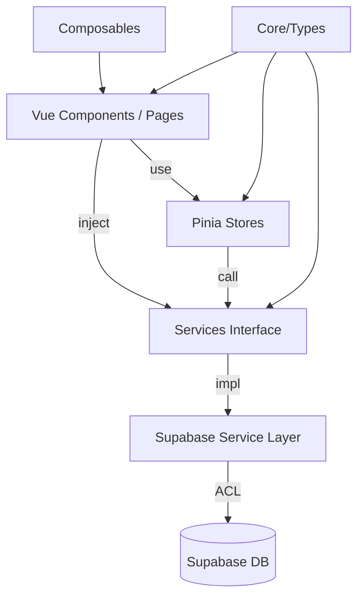

# Design: Arquitetura Limpa e UI Atômica para Divi

## Context
O projeto Divi é uma aplicação de Controle Financeiro em transição do boilerplate inicial do Quasar para uma arquitetura robusta de nível industrial. Este design visa implementar o padrão exigido no `config.yaml`: Clean Architecture + DDD + Atomic Design, priorizando a densidade do código e a eficiência operacional.

## Goals
- Remover todos os artefatos de exemplo (boilerplate).
- Isolar o Supabase através de uma camada de infraestrutura/serviços com interfaces puras.
- Reestruturar os componentes seguindo Atomic Design.
- Garantir que nenhum componente TypeScript ultrapasse 150 linhas (SRP estrito).
- Centralizar o estado de UI em um store Pinia leve (`ui.ts`).

## Non-Goals
- Migrar para outro banco de dados que não seja Supabase.
- Adicionar novas funcionalidades de negócio além da infraestrutura necessária.
- Alterar as bibliotecas base (Vue 3, Quasar, Pinia).

## Design Decisions

### 1. Inversão de Controle (IoC) via Quasar Boot
Os serviços (Auth, Finance) serão definidos por interfaces em `src/core/services`. Uma factory ou arquivo de boot injetará as instâncias concretas (Supabase) via `app.provide` do Vue.
*   **Rationale**: Permite testes unitários perfeitos sem tocar na rede e facilita futuras migrações de infraestrutura.

### 2. Composable-First Strategy
Lógica de estado e navegação não-reativa ao componente em si será movida para `src/composables`.
*   **Exemplo**: `useNavigationLogic` isolará o roteamento e menus, limpando o `DesktopSidebar.vue`.

### 3. Hierarquia Atômica (Gestalt)
Componentes customizados serão organizados em:
- **Atoms**: Q-Buttons com estilos específicos, ícones estilizados.
- **Molecules**: Itens de lista, inputs com labels, cards de saldo.
- **Organisms**: Sidebar, Header, Dashboards, Listas Complexas de Transações.

### 4. Gestão de Estado via Pinia (Facade)
Pinia será usado como uma fachada fina que delega chamadas pesadas para a camada de serviços. Stores devem conter apenas o estado sincronizado (ex: `transactions: []`) e metadados de carregamento.

## Architecture / Diagram

## Risks / Trade-offs
- **Complexidade Inicial**: Mais pastas e arquivos inicialmente comparado ao Quasar Padrão.
- **Overhead de Injeção**: Pequeno custo cognitivo em usar `inject` nos componentes, mitigado por bons tipos no TypeScript.
- **Adaptação**: Necessidade de garantir que o time siga as restrições de SRP (150 linhas).
